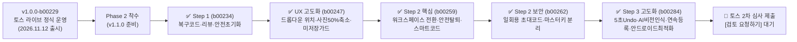
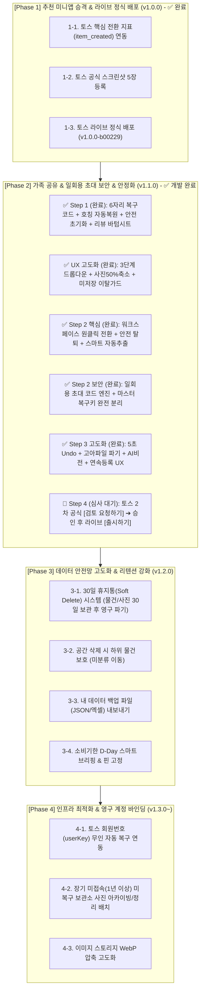
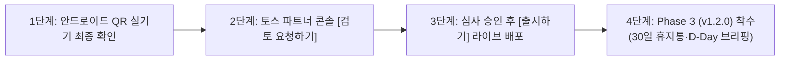

# 🗺️ '아 찾았다 · 내 물건 찾기' 마스터 종합 개발 로드맵
> **부제**: 토스 추천 미니앱 승격 전략 및 유저 데이터 100% 안전성 보장 통합 플랜  
> **최종 갱신일**: 2026-11-23 (Phase 2 - v1.1.0-b00284 기능 개발·안정화 100% 완료 및 심사 대기)

---

## 📌 1. 현재까지의 개발 및 출시 현황 (As-Is)

현재 **`아 찾았다 · 내 물건 찾기`**는 **`v1.0.0-b00229`**가 토스 실서비스(Live)에 정상 운영 중이며, **`Phase 2 (v1.1.0)`**는 **`b00230` ~ `b00284`**에 걸쳐 데이터 백업·복원, 워크스페이스 전환 모델, 일회용 초대 보안 엔진, AI Vision 스마트 인식, 연속 등록 편의성 및 안드로이드/실기기 최적화까지 **전체 목표 기능 개발 및 안정화가 100% 완료**되었습니다.

```mermaid
flowchart LR
    A["v1.0.0-b00229\n토스 라이브 정식 운영\n(2026.11.12 출시)"] --> B["Phase 2 착수\n(v1.1.0 준비)"]
    B --> C["✅ Step 1 (b00234)\n복구코드·리뷰·안전초기화"]
    C --> D["✅ UX 고도화 (b00247)\n드롭다운 위치·사진50%축소·미저장가드"]
    D --> E["✅ Step 2 핵심 (b00259)\n워크스페이스 전환·안전탈퇴·스마트코드"]
    E --> F["✅ Step 2 보안 (b00262)\n일회용 초대코드·마스터키 분리"]
    F --> G["✅ Step 3 고도화 (b00284)\n5초Undo·AI비전인식·연속등록·안드로이드최적화"]
    G --> H["🎯 토스 2차 심사 제출\n[검토 요청하기] 대기"]
```

### 1.1 주요 달성 성과 (7대 핵심 마일스톤 완료)
1. **데이터 백업 & 영구 복구 안전망 구축 (`b00230` ~ `b00234`)**:
   - 6자리 영구 마스터 복구 코드 발급 & 1초 보관소 복원 시스템 구축 (스마트폰 분실/교체 대비)
   - 복원 시 기존 소유자 호칭(**`Ed.Kim`**) 자동 상속 및 동기화
   - 대화형 인앱 리뷰 바텀시트(1~5점 별점, 키워드 칩, 햅틱 피드백) 탑재
   - 공장 초기화 시 위험한 실행 경고 확인(내 호칭 검증) 2단계 안전장치 탑재
2. **UX 고도화 & 데이터 무손실 보호 (`b00235` ~ `b00247`)**:
   - 공간/수납처/세부위치 3단계 계층을 한눈에 파악하는 **컴팩트 사진 드롭다운 선택기** 전면 도입
   - 물건 수정 중 미저장 이탈 시 데이터 롤백 및 안전 확인 팝업(`hasUnsavedChanges`) 일원화
   - 바텀시트 내 물건 사진 크기 50% 축소(140px 캡)로 핵심 정보(위치, 수량, 유통기한) 가독성 극대화
   - 실수 삭제 즉시 복구 **5초 Undo 토스트** 및 삭제 시 스토리지 고아 이미지 파일 동시 파기 파이프라인 탑재
3. **가족 공유 & 워크스페이스 전환 모델 (`b00248` ~ `b00259`)**:
   - 위험한 병합(Merge)을 배제하고 개인 보관소를 100% 보존하는 **워크스페이스 전환(Switching) 모델** 탑재
   - 가족 보관소 탈퇴 시 내 개인 보관소로 안전 복귀(`Safe Leave & Revert`) 검증 완료
   - 가족 공유 메시지 3줄 간소화 및 호칭 자동 주입
   - 메신저 전체 텍스트 붙여넣기 시 코드만 자동 판별하는 **스마트 코드 자동 추출(Smart Auto-Extraction)** 탑재
4. **일회용 초대 코드 보안 엔진 구축 (`b00260` ~ `b00262`)**:
   - **마스터 복구키(소유자 영구 보관)**와 **가족 초대 코드(1회용 소모품 티켓)** 완전 분리
   - 초대 코드는 1회 승인 시 영구 파기(Used), 24시간 TTL, 원터치 새 티켓 재발급
   - 초대 코드로 보관소 복구 시도 시 원천 차단
5. **시각 디자인 & 내비게이션 고도화 (`b00263` ~ `b00273`)**:
   - 스크롤 40px 감지 시 우측 하단 스크롤 최상단(Top) 플로팅 버튼 노출
   - 토스 스타일 반투명 헤더(90% 투명도 + 4px blur) 및 하단 네비게이션 통일
   - 설정 탭 터치 시 Pop-to-Root 처리 (서브페이지에서 메인 설정 복귀)
   - 물건 등록 화면에서 사진 등록 섹션을 물건명칭 아래로 재배치하여 자연스러운 시선 흐름 완성
6. **AI Vision 스마트 인식 & 연속 등록 UX (`b00274` ~ `b00280`)**:
   - Google Gemini Vision 실시간 연동: 사진 업로드 시 물건 명칭 및 태그 자동 추천 (`VITE_GEMINI_API_KEY`)
   - **이전 위치 3단계 자동 기억**: 같은 위치에 여러 물건을 연속 등록할 때 매번 위치 선택 불필요
   - 저장 완료 후 스크롤 최상단(Top) 자동 이동으로 연속 등록 속도 극대화
7. **실기기/안드로이드 최적화 & 크래시 방지 (`b00281` ~ `b00284`)**:
   - 카메라 고화질 사진 메모리 크래시 방지 (Blob URL 구조 전환 + 1024px 선제 압축)
   - 홈/탐색/검색 물건 리스트 뷰 내 한 줄 메모(설명) 표시 및 브레드크럼 스크롤 고정 (`sticky`)
   - 수납처/세부위치 수정 모달 내 사진 선택기 최상위 포털(`z-index: 11000`) 승격
   - 토스 네이티브 뒤로가기 화살표(`withBackButton: true`) 복원 및 가상 키보드 선제 해제(`activeElement.blur()`)

---

## 💡 2. 당면 핵심 과제 및 데이터 위협 요인 분석

| 영역 | 위험 시나리오 / 사용자 고민 | 해결 방안 및 현황 |
| :--- | :--- | :--- |
| **토스 노출 극대화** | 단순 검색창 노출에 머물러 신규 유저 유입이 제한됨 | **[완료]** 토스 추천 미니앱 승격을 위한 **핵심 전환 지표(`item_created`)** 및 **대화형 인앱 리뷰 바텀시트** 구축 |
| **기기 변경 / 분실** | 새 스마트폰 교체나 앱 재설치 시 데이터 유실 | **[완료]** **영구 마스터 복구 코드** 발급 및 1초 복원 (장기적 **토스 userKey 연동**) |
| **초대 시 소유권 탈취 위험** | 가족 초대 시 복구 코드가 노출되어 소유권 탈취 가능성 | **[완료 (b00260)] 일회용 초대 코드(One-time Ticket) 분리 엔진** • 영구 복구 마스터키(나만 보관) vs 일회용 초대 코드 완전 분리 • 초대 코드는 1회 사용(승인) 시 즉시 영구 파기(Used) • 24시간 자동 만료(TTL) 및 원터치 새 초대 코드 재발급 지원 • 초대 코드로 보관소 복구(소유권 획득) 시도 시 원천 차단 |
| **가족 합류 시 데이터 오염** | 기존 병합(Merge) 방식의 중복 공간 생성, 롤백 불가, 메인 보관소 오염 위험 | **[완료] '워크스페이스 전환' 모델** • 가족 합류 시 메인 보관소로 데이터 강제 병합하지 않음 • 기존 기기 데이터는 **[내 개인 보관소]**로 100% 안전 분리 보존 • **[가족 보관소] ↔ [내 개인 보관소] 원클릭 전환** 지원 |
| **공유 코드 입력 번거로움** | 메신저에서 메시지 복사 시 긴 문장과 함께 복사되어 입력 오류 발생 | **[완료] 스마트 코드 자동 추출** • 메신저 3줄 문장 전체를 붙여넣어도 `wii-xxxxxx` 또는 6자리 코드만 스마트하게 추출 |
| **사진 용량 / 고아 파일** | 물건 삭제 후에도 사진 파일이 남아 스토리지를 잠식 | **[완료 (b00272)]** **물건/수납처 삭제 시 Supabase Storage 이미지 파일 동시 파기** |
| **실수로 인한 삭제** | 공간이나 물건을 실수로 잘못 삭제했을 때 복구 불가 | **[완료 (b00272)]** **삭제 직후 5초 '실행 취소(Undo)' 토스트** / **[Phase 3]** **30일 휴지통** |
| **연속 물건 등록 번거로움** | 같은 위치에 여러 물건을 등록할 때 매번 3단계 위치를 반복 선택 | **[완료 (b00279~b00280)]** **이전 3단계 위치 자동 기억 & 저장 완료 후 Top 자동 스크롤** |
| **고화질 사진 메모리 크래시** | 카메라 촬영 직후 메모리 급증으로 미니앱 재로딩 현상 | **[완료 (b00281)]** **Blob URL 도입 및 1024px 선제 압축 파이프라인** |
| **안드로이드 터치 지연/종료** | 가상 키보드 활성화 상태에서 버튼이나 뒤로가기 터치 시 무반응/지연 | **[완료 (b00284)]** **네이티브 뒤로가기(`[ < ]`) 복원, 선제 포커스 블러(`activeElement.blur()`)** |
| **리텐션(재방문율)** | 물건을 등록한 뒤 다시 앱을 열어볼 동기 부족 | **[Phase 3]** **소비기한 임박 D-Day 스마트 브리핑** 및 자주 찾는 물건 핀 고정 |

---

## 🛡️ 3. 유저 데이터 100% 안전 보장을 위한 5대 핵심 안전망

```mermaid
flowchart TD
    subgraph S1["[1. 계정 및 복구 안전망 (완료 및 고도화)]"]
        S1_1["✅ 영구 마스터 복구 코드 발급 & 1초 복원"]
        S1_2["✅ 소유자 호칭(Ed.Kim) 자동 상속·복원"]
        S1_3["✅ 공장 초기화 내 호칭 검증 2단계 안전장치"]
        S1_4["✅ 일회용 초대 코드(One-time Ticket) 분리 발급 & 승인 시 자동 소멸"]
        S1_5["토스 회원번호(userKey) 영구 바인딩 (Phase 4)"]
    end

    subgraph S2["[2. UX 실수 방지 & 연속 등록 최적화 (완료)]"]
        S2_1["✅ 수정 중 이탈 시 미저장 롤백 & 확인 팝업 (완료)"]
        S2_2["✅ 스마트 코드 자동 추출로 오타 및 오입력 방지 (완료)"]
        S2_3["✅ 삭제 직후 5초 '실행 취소(Undo)' 토스트 (완료)"]
        S2_4["✅ 물건 삭제 시 스토리지 고아 이미지 동시 파기 (완료)"]
        S2_5["✅ Gemini AI 비전 명칭/태그 추천 & 이전위치 자동기억 (완료)"]
        S2_6["30일 휴지통 (Soft Delete) (Phase 3)"]
    end

    subgraph S3["[3. 클라우드 영구 보존 & 스토리지 정책]"]
        S3_1["✅ 텍스트 데이터(공간/물건): 무기한 평생 영구 보존"]
        S3_2["✅ Blob URL 도입 및 클라이언트 1024px 선제 압축 (메모리 안정화)"]
        S3_3["장기 방치(1년 이상 미복구) 보관소 사진 아카이빙 정책 (Phase 4)"]
    end

    subgraph S4["[4. 가족 보관소 분리 보존 & 원클릭 전환 (완료)]"]
        S4_1["✅ 불안한 데이터 병합(Merge) 완전 폐기 ➔ 오염 원천 차단"]
        S4_2["✅ 가족 합류 시 기존 데이터는 [내 개인 보관소]로 100% 안전 보존"]
        S4_3["✅ 홈 헤더/설정에서 [가족 보관소] ↔ [내 개인 보관소] 1초 전환"]
        S4_4["✅ 가족 보관소 탈퇴 시 내 개인 보관소 안전 복귀"]
    end

    subgraph S5["[5. 클라우드 보안 & 백업]"]
        S5_1["✅ Supabase RLS 타인 접근 원천 차단"]
        S5_2["✅ 일회용 코드 만료 시 재사용 원천 차단"]
        S5_3["✅ Supabase 일일 자동 스냅샷 백업"]
    end

    S1 --> S2
    S2 --> S3
    S3 --> S4
    S4 --> S5
```

---

## 🚀 4. 통합 단계별 개발 로드맵 (To-Be)

```mermaid
flowchart TD
    subgraph Phase1["[Phase 1] 추천 미니앱 승격 & 라이브 정식 배포 (v1.0.0) - ✅ 완료"]
        P1_1["1-1. 토스 핵심 전환 지표(item_created) 연동"]
        P1_2["1-2. 토스 공식 스크린샷 5장 등록"]
        P1_3["1-3. 토스 라이브 정식 배포 (v1.0.0-b00229)"]
    end

    subgraph Phase2["[Phase 2] 가족 공유 & 일회용 초대 보안 & 안정화 (v1.1.0) - ✅ 개발 완료"]
        P2_Step1["✅ Step 1 (완료): 6자리 복구코드 + 호칭 자동복원 + 안전 초기화 + 리뷰 바텀시트"]
        P2_StepUX["✅ UX 고도화 (완료): 3단계 드롭다운 + 사진50%축소 + 미저장 이탈가드"]
        P2_Step2["✅ Step 2 핵심 (완료): 워크스페이스 원클릭 전환 + 안전 탈퇴 + 스마트 자동추출"]
        P2_StepSec["✅ Step 2 보안 (완료): 일회용 초대 코드 엔진 + 마스터 복구키 완전 분리"]
        P2_Step3["✅ Step 3 고도화 (완료): 5초 Undo + 고아파일 파기 + AI비전 + 연속등록 UX"]
        P2_Step4["🎯 Step 4 (심사 대기): 토스 2차 공식 [검토 요청하기] ➔ 승인 후 라이브 [출시하기]"]
    end

    subgraph Phase3["[Phase 3] 데이터 안전망 고도화 & 리텐션 강화 (v1.2.0)"]
        P3_1["3-1. 30일 휴지통(Soft Delete) 시스템 (물건/사진 30일 보관 후 영구 파기)"]
        P3_2["3-2. 공간 삭제 시 하위 물건 보호 (미분류 이동)"]
        P3_3["3-3. 내 데이터 백업 파일(JSON/엑셀) 내보내기"]
        P3_4["3-4. 소비기한 D-Day 스마트 브리핑 & 핀 고정"]
    end

    subgraph Phase4["[Phase 4] 인프라 최적화 & 영구 계정 바인딩 (v1.3.0~)"]
        P4_1["4-1. 토스 회원번호(userKey) 무인 자동 복구 연동"]
        P4_2["4-2. 장기 미접속(1년 이상) 미복구 보관소 사진 아카이빙/정리 배치"]
        P4_3["4-3. 이미지 스토리지 WebP 압축 고도화"]
    end

    Phase1 --> Phase2
    Phase2 --> Phase3
    Phase3 --> Phase4
```

---

### 📍 Phase 2 상세 계획: 일회용 초대 코드 & 워크스페이스 전환 모델 (`v1.1.0`)

#### 1. 마스터 복구키 vs 일회용 초대 코드 분리 아키텍처 (`b00260`)
- **보관소 복구 코드 (Master Recovery Key)**:
  - 기기 변경 / 앱 재설치 시 소유자 본인 인증 및 보관소 복원 전용.
  - 외부 노출 절대 금지 (나만 안전하게 보관).
  - 입력 시 즉시 소유자(Owner) 권한 복원.
- **가족 초대 코드 (One-Time Invite Ticket)**:
  - 가족에게 카카오톡 메시지로 공유하는 1회용 티켓.
  - 소유자가 원터치로 발급(`[가족 초대 코드 생성]`).
  - 참여자 입력 시 [참여 신청]만 가능하며, 복구 메뉴에 입력 시 접근 원천 차단.
  - 소유자가 [승인]하는 즉시 **해당 코드는 영구 만료(Used)** 처리되어 재사용 불가.
  - 미사용 시에도 24시간 후 자동 만료. 언제든 새 코드 원터치 재발급 가능.

#### 2. 가족 보관소 합류 및 워크스페이스 전환 UX
- **가족 합류 시 무손실 보존**:
  - 기존 기기의 데이터를 메인 가족 보관소로 억지로 합치지 않음(Zero Collision).
  - 기존 데이터는 `[내 개인 보관소]`로 100% 안전 격리 보존.
- **원클릭 전환**:
  - 홈 상단 헤더 및 설정 탭에서 `[가족 보관소] ↔ [내 개인 보관소]` 원터치 1초 전환.
- **안전 탈퇴 및 원상 복구**:
  - 가족 보관소 탈퇴 시 내 개인 보관소로 100% 원형 그대로 복귀.

---

## 📋 5. 종합 우선순위 결정 매트릭스 (최신 갱신)

| 우선순위 | 작업 항목 | 진행 상태 | 기대 효과 |
| :---: | :--- | :---: | :--- |
| **P0 (보안/안전)** | **일회용 초대 코드 엔진 & 복구키 분리** | **✅ 구현 완료 (`b00260`)** | **복구 마스터키 노출 원천 차단**, 1회 사용 후 소멸하는 완벽한 보안성 |
| **P0 (핵심)** | **가족 보관소 워크스페이스 전환 모델** | **✅ 완료 (Phase 2-Step 2)** | **불안한 Merge 폐기**, 메인 보관소 오염 원천 차단, 100% 무손실 안전 공유 |
| **P0 (UX)** | **스마트 코드 자동 추출 & 메시지 간소화** | **✅ 완료 (Phase 2-Step 2)** | 메신저 3줄 복사-붙여넣기 시 코드만 자동 추출, 사용자 오입력 0% |
| **P1 (안정성)** | **가족 보관소 안전 탈퇴 및 원상 복구** | **✅ 완료 (Phase 2-Step 2)** | 탈퇴 시 개인 보관소 100% 보존 복귀 |
| **P1 (최적화)** | **5초 Undo & 스토리지 고아파일 동시 파기** | **✅ 완료 (`b00272`)** | 실수 삭제 즉시 복구 및 **스토리지 용량 누수 방지** |
| **P1 (AI/등록)** | **Gemini AI 비전 명칭/태그 추천 & 연속 등록 위치 기억** | **✅ 완료 (`b00278~280`)** | 사진만 찍으면 이름/태그 자동입력 및 이전 3단계 위치 자동 기억 |
| **P1 (실기기)** | **카메라 크래시 방지 & 네이티브 뒤로가기·포커스 최적화** | **✅ 완료 (`b00281~284`)** | 안드로이드/iOS 실기기 반응성 극대화 및 고화질 메모리 안정화 |
| **P2 (안전/리텐션)** | **30일 휴지통(Soft Delete) & 소비기한 D-Day 브리핑** | 대기 (Phase 3) | 실수 삭제 완벽 복원 및 매일/매주 재방문율(리텐션) 증가 |
| **P3 (고도화/운영)** | **토스 userKey 영구 바인딩 & 장기 방치 사진 수명주기 관리** | 대기 (Phase 4) | 무인 자동 복구 완성 및 장기 클라우드 비용/성능 최적화 |

---

## 📊 6. 토스 라이브(v1.0.0) vs Phase 2 완료(v1.1.0-b00284) 기능 비교표

| 기능 항목 | 토스 라이브 (`v1.0.0-b00229`) | Phase 2 개발 완료 (`v1.1.0-b00284`) | 기대 효과 / 사용자 가치 |
| :--- | :---: | :---: | :--- |
| **보관소 복구** | 미지원 (기기 변경 시 재설치 필요) | **✅ 6자리 영구 마스터 복구 코드로 1초 복원** | 기기 교체나 앱 재설치 시에도 데이터 100% 영구 보존 |
| **가족 보관소 공유** | 미지원 (단일 사용자 전용) | **✅ 워크스페이스 전환 모델로 100% 안전 공유** | 기존 데이터 오염/충돌 없는 안전한 가족/부부 공동 보관소 |
| **초대 코드 보안** | - | **✅ 승인 시 즉시 소멸하는 1회용 티켓 엔진** | 소유권 탈취 위험 원천 차단 및 만료/재발급 완벽 통제 |
| **사진 위치 등록 UX** | 기본 선택 화면 | **✅ 컴팩트 3단계 사진 드롭다운 선택기** | 화면 이탈 없이 공간-수납처-세부위치를 한 화면에서 원터치 지정 |
| **삭제 복구 안전망** | 삭제 시 즉시 영구 삭제 | **✅ 5초 Undo 토스트 & 스토리지 고아파일 동시 파기** | 실수 삭제 즉시 복구 및 불필요한 스토리지 용량 누수 방지 |
| **AI 비전 자동 명칭** | 수동 텍스트 입력 | **✅ Gemini AI 비전 연동 (사진 찍으면 이름/태그 추천)** | 사진만 찍으면 AI가 물건 이름과 관련 카테고리 태그 자동 입력 |
| **연속 물건 등록** | 매번 공간-수납처-세부위치 재선택 | **✅ 이전 위치 3단계 자동 기억 & 완료 후 Top 스크롤** | 같은 서랍/선반 정리 시 연속 등록 시간 70% 이상 단축 |
| **목록 내 메모 확인** | 상세 바텀시트 진입 필요 | **✅ 홈/탐색/검색 리스트에서 한 줄 메모 즉시 확인** | 물건 명칭과 위치 사이에서 상세 설명/용도를 목록에서 바로 파악 |
| **기기 내비게이션** | 모바일 제스처/시스템 뒤로가기 의존 | **✅ 토스 네이티브 [ < ] 뒤로가기 + LIFO 종료 가드** | 안드로이드/iOS 일관된 터치감 및 가상 키보드 선제 해제(blur) |

---

## 🚀 7. Phase 2 심사 제출 및 향후 추천 진행 절차 (Next Step)

Phase 2에서 계획된 모든 기능 및 실기기 안정화 작업이 현재 빌드(**`v1.1.0-b00284`**)에 완벽하게 반영되었습니다.

```mermaid
flowchart LR
    S1["1단계: 안드로이드 QR 실기기 최종 확인"] --> S2["2단계: 토스 파트너 콘솔 [검토 요청하기]"]
    S2 --> S3["3단계: 심사 승인 후 [출시하기] 라이브 배포"]
    S3 --> S4["4단계: Phase 3 (v1.2.0) 착수\n(30일 휴지통·D-Day 브리핑)"]
```

1. **1단계: 안드로이드 QR 실기기 최종 확인**
   - 최신 QR 테스트를 통해 상단 `[ < ]` 뒤로가기 및 전반적인 인터랙션 반응성을 최종 점검.
2. **2단계: 토스 파트너 콘솔 2차 공식 심사 제출 ([검토 요청하기])**
   - [토스 파트너스 콘솔](https://apps-in-toss.toss.im/)에서 최신 빌드(`v1.1.0-b00284`)를 선택하고 **[검토 요청하기]** 진행.
   - 가족 공유 워크스페이스 모델 및 영구 복구 시스템 정식 심사 요청.
3. **3단계: 심사 승인 후 무중단 라이브 서비스 [출시하기]**
   - 토스 검토 승인 완료 즉시 콘솔에서 원클릭으로 전체 토스 사용자에게 무중단 라이브 배포.
4. **4단계: Phase 3 착수 (`v1.2.0`)**
   - 라이브 배포 완료 후 장기 데이터 보존을 위한 **30일 휴지통(Soft Delete)** 및 재방문율을 높이는 **소비기한 임박 D-Day 스마트 브리핑** 개발 단계로 진입.
