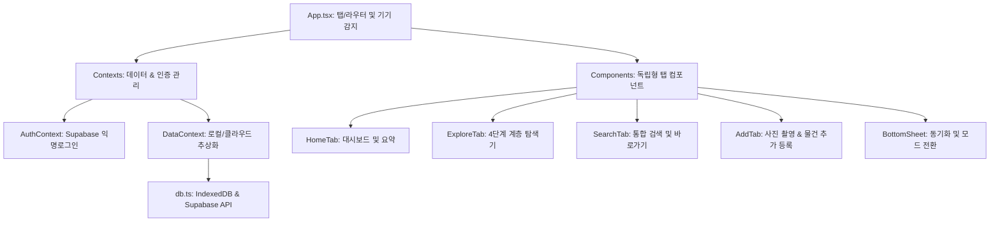

# 📦 WhereIsIt (물건 위치 관리 웹앱) 프로젝트 개발 및 기술 명세서

본 문서는 **WhereIsIt** 프로젝트의 현재까지의 개발 진행 상황, 시스템 아키텍처, 핵심 문제 해결 사례 및 향후 확장 계획을 일목요연하게 정리한 공식 기술 명세서입니다. 구글 Docs 또는 사내 wiki 등에 복사하여 그대로 활용하실 수 있도록 표준 Markdown 형식으로 구성되었습니다.

---

## 1. 프로젝트 개요 (Project Overview)

* **프로젝트명**: WhereIsIt (내 물건 어디 있지?)
* **개발 목표**: 토스 인앱(Toss In-App) 웹뷰 탑재 및 iOS App Store / Google Play Store 하이브리드 앱 출시를 목표로 하는 모바일-퍼스트 프리미엄 물건 관리 서비스.
* **핵심 가치**:
  * **프리미엄 UI/UX**: 토스(Toss) 스타일의 미니멀하고 고급스러운 디자인 시스템, HSL 컬러 팔레트, 부드러운 애니메이션 및 바텀시트 적용.
  * **직관적인 공간 탐색**: 공간 ➔ 수납공간 ➔ 수납칸 ➔ 물건으로 이어지는 체계적인 4단계 계층 탐색기 구현.
  * **하이브리드 동기화**: 단일 기기 중심의 오프라인 로컬 저장(IndexedDB/Local) 모드와 실시간 다기기 동기화를 지원하는 클라우드 공유(Supabase) 모드의 유연한 전환 지원.
  * **네이티브 카메라 연동**: 물건 등록 시 카메라 실시간 촬영 및 사진 앨범 업로드를 완벽 지원하여 직관적인 보관 관리 가능.

---

## 2. 기술 스택 (Technology Stack)

| 구분 | 적용 기술 | 선정 이유 및 역할 |
| :--- | :--- | :--- |
| **Frontend** | React 18, TypeScript, Vite | 초고속 핫 리로딩 개발 환경 제공 및 안정적인 컴파일러 검증 수행 |
| **Styling** | Vanilla CSS, Flexbox/Grid | 프레임워크에 구속되지 않고 토스 특유의 섬세한 인터랙션과 디자인을 100% 커스텀 제어 |
| **Database** | Supabase (PostgreSQL), IndexedDB | 로컬 샌드박스 데이터 보관 및 다기기 간의 실시간 PostgreSQL 데이터 동기화 |
| **Auth** | Supabase Anonymous Sign-In | 복잡한 가입 절차 없이 토스 인앱에서 원클릭으로 동기화 세션을 생성하기 위한 익명 로그인 탑재 |
| **Storage** | Supabase Storage Bucket | 등록된 물건의 실시간 사진 업로드 및 Public URL 배포 인프라 구축 |
| **Build & CI** | Vercel / GitHub Actions | 원격 저장소 푸시 시 자동 빌드 및 실시간 Vercel 호스팅 배포 연동 |

---

## 3. 시스템 아키텍처 및 디렉토리 구조

본 프로젝트는 완벽한 역할 분담과 유지보수의 용이성을 위해 단방향 데이터 흐름을 준수하며 다음과 같이 모듈화되어 있습니다.



### 📂 디렉토리 구조 및 핵심 파일 설명
* **`src/App.tsx`**: 애플리케이션의 핵심 오케스트레이터. 네비게이션 탭 라우팅, 모바일 디바이스 감지 및 전역 CSS 클래스 제어를 총괄합니다.
* **`src/contexts/`**
  * **`AuthContext.tsx`**: Supabase의 익명 로그인을 기반으로 공유 코드가 매칭되었을 때 세션을 자동으로 연동하는 인증 컨텍스트.
  * **`DataContext.tsx`**: 로컬 모드와 클라우드 공유 모드를 실시간으로 감지하여, 하위 컴포넌트들이 저장 형태에 무관하게 동일한 인터페이스로 데이터 CRUD를 요청할 수 있도록 추상화한 데이터 허브.
* **`src/components/`**
  * **`HomeTab.tsx`**: 전체 공간 수, 물건 종류 수 등의 통계 지표와 최근 등록된 물건을 한눈에 보여주는 프리미엄 대시보드.
  * **`ExploreTab.tsx`**: 공간 ➔ 수납공간 ➔ 수납칸 ➔ 물건을 수평적 슬라이드로 탐색하며 편집(추가/수정/삭제)할 수 있는 계층형 탐색 브라우저.
  * **`SearchTab.tsx`**: 키워드 입력 즉시 공간, 수납칸, 물건 명칭을 검색하여 해당 물리적 위치로 원클릭 이동(바로가기)하는 통합 검색 엔진.
  * **`AddTab.tsx`**: 모바일 환경에서 가장 편리하게 물건을 등록할 수 있도록 최적화된 사진 촬영, 앨범 선택 및 태그 지정 입력 폼.
  * **`BottomSheet.tsx`**: 하단에서 부드럽게 올라오는 토스 스타일 UI로, 실시간 데이터 공유 코드를 복사하거나 입력해 즉시 연동하는 제어 센터.
* **`src/services/db.ts`**: 브라우저 로컬 스토리지(IndexedDB) CRUD 로직과 Supabase REST API 통신 모듈을 정합성 있게 하나로 묶어 제공하는 서비스 레이어.

---

## 4. 핵심 문제 해결 사례 (Key Issue Resolutions)

모바일 웹앱 및 토스 인앱 환경에서 발생하는 하이브리드 고질병을 정밀 추적하여 완벽히 해결한 기술적 성과입니다.

### 4.1. iOS Safari/웹뷰 언마운트 시 뷰포트 배율 고착 버그 해결 (`v00004`)
* **문제 증상**: 모바일 브라우저 환경에서 물건 추가(`AddTab`) 탭의 입력칸에 포커싱되어 가상 키보드가 활성화된 상태에서, 키보드를 닫지 않고 하단 내비게이션 바를 눌러 탭을 급격히 전환하면 컴포넌트가 언마운트되면서 iOS 브라우저 렌더링 엔진이 포커스 상태를 잃어버리고 가로 화면을 영구적으로 축소해 버리는 치명적인 왜곡 현상이 발생했습니다.
* **해결 방안**: 탭 전환을 수행하는 공통 분기 함수인 `handleNavigateTab` 내부 최상단에 아래 코드를 탑재했습니다.
  ```typescript
  // 탭 전환 시 현재 활성화된 포커싱 요소를 강제로 안전하게 해제
  if (document.activeElement && 'blur' in document.activeElement) {
    (document.activeElement as HTMLElement).blur();
  }
  ```
  이 조치로 가상 키보드가 항상 정상적으로 슬라이드 다운된 후 컴포넌트 파괴가 일어나도록 보장하여 화면 쪼그라듬 현상을 전면 해결했습니다.

### 4.2. 반응형 미디어 쿼리 한계 극복을 위한 JS 기기 감지 클래스 시스템 구축 (`v00005`)
* **문제 증상**: 기존에는 데스크톱 프레임을 구분하기 위해 CSS `@media (min-width: 769px)` 미디어 쿼리를 사용했습니다. 그러나 모바일 기기에서 가상 키보드가 켜지고 꺼지는 순간 또는 탭 전환 순간에 브라우저 리플로우(Reflow)가 발생하면서 일시적으로 뷰포트 가로 폭을 769px 이상으로 오인해 모바일 기기임에도 데스크톱용 프레임(480px Centered Card)으로 강제 변형되는 반응형 구조의 고질적인 한계가 발견되었습니다.
* **해결 방안**: 미디어 쿼리에만 의존하던 기존의 구조를 완전히 철폐하고, **JS 기반의 하드웨어/디바이스 감지식 클래스 바인딩 시스템**을 도입했습니다.
  * 최상단 `App` 컴포넌트 마운트 시, `navigator.userAgent`, 터치 지원 여부(`maxTouchPoints`), 기본 화면 폭을 복합 검증하여 모바일/태블릿 기기는 데스크톱 시뮬레이터에서 영구 제외시킵니다.
  * 오직 실제 마우스나 트랙패드를 사용하는 순수 PC/Mac 환경에서만 `body` 태그에 `.desktop-simulator` 클래스를 주입합니다.
  ```typescript
  useEffect(() => {
    const checkIsDesktop = () => {
      const userAgent = navigator.userAgent.toLowerCase();
      const isMobileDevice = /iphone|ipad|ipod|android|blackberry|windows phone/i.test(userAgent);
      const hasTouch = ('ontouchstart' in window) || (navigator.maxTouchPoints > 0);
      
      // 모바일 디바이스이거나 터치 스크린 기기인 경우 데스크톱 시뮬레이터 적용 배제
      if (isMobileDevice || hasTouch) {
        document.body.classList.remove('desktop-simulator');
      } else {
        document.body.classList.add('desktop-simulator');
      }
    };
    
    checkIsDesktop();
  }, []);
  ```
  * 이로 인해 모바일 기기에서는 뷰포트 배율이나 크기가 순간적으로 흔들리더라도 시뮬레이터 CSS가 절대 발동하지 않으며, 네이티브 앱과 같이 굳건하게 100% 꽉 찬 모바일 풀스크린 상태를 유지하게 되었습니다.

---

## 5. 데이터베이스 스키마 및 연동 방법 (Database Setup)

클라우드 동기화 모드를 완벽하게 구동하기 위해 Supabase에 설정된 스키마 구조와 권장 보안 세팅입니다.

### 5.1. DDL Schema (PostgreSQL)
```sql
-- 1. 공간 (Spaces)
CREATE TABLE spaces (
  id UUID PRIMARY KEY DEFAULT gen_random_uuid(),
  name TEXT NOT NULL,
  created_at TIMESTAMP WITH TIME ZONE DEFAULT timezone('utc'::text, now()) NOT NULL,
  user_id UUID DEFAULT auth.uid()
);

-- 2. 수납공간 (Storages)
CREATE TABLE storages (
  id UUID PRIMARY KEY DEFAULT gen_random_uuid(),
  space_id UUID REFERENCES spaces(id) ON DELETE CASCADE,
  name TEXT NOT NULL,
  created_at TIMESTAMP WITH TIME ZONE DEFAULT timezone('utc'::text, now()) NOT NULL,
  user_id UUID DEFAULT auth.uid()
);

-- 3. 수납칸 (Sections)
CREATE TABLE sections (
  id UUID PRIMARY KEY DEFAULT gen_random_uuid(),
  storage_id UUID REFERENCES storages(id) ON DELETE CASCADE,
  name TEXT NOT NULL,
  created_at TIMESTAMP WITH TIME ZONE DEFAULT timezone('utc'::text, now()) NOT NULL,
  user_id UUID DEFAULT auth.uid()
);

-- 4. 물건 (Items)
CREATE TABLE items (
  id UUID PRIMARY KEY DEFAULT gen_random_uuid(),
  section_id UUID REFERENCES sections(id) ON DELETE CASCADE,
  name TEXT NOT NULL,
  memo TEXT,
  image_url TEXT,
  created_at TIMESTAMP WITH TIME ZONE DEFAULT timezone('utc'::text, now()) NOT NULL,
  user_id UUID DEFAULT auth.uid()
);
```

### 5.2. 필수 Supabase 보안 및 설정 환경 가이드
1. **Anonymous Sign-In 활성화**: 
   * `Authentication` ➔ `Providers` ➔ `Anonymous` 메뉴에서 **Allow Anonymous Sign-Ins**를 ON으로 활성화해야 가입 페이지 없이 실시간 데이터 연동이 가능합니다.
2. **이메일 인증(Confirm Email) 비활성화**:
   * `Authentication` ➔ `Providers` ➔ `Email` 메뉴에서 **Confirm email** 옵션을 OFF로 비활성화합니다.
   * *이유*: 무료 등급 Supabase의 메일 발송 쿼터(시간당 3회) 한계로 인해 발생하는 이메일 전송 실패(`email rate limit exceeded`) 오류를 원천 차단하고 즉시 접속을 보장하기 위함입니다.
3. **Storage 버킷 권한**:
   * `item-images` 라는 이름의 Storage 버킷을 생성하고 권한을 **Public**으로 오픈하여 물건의 사진 URL을 외부 웹뷰에서도 에러 없이 렌더링하도록 설정했습니다.
   * RLS를 통해 본인의 물건 사진만 추가/삭제할 수 있도록 구성했습니다.

---

## 6. 배포 및 향후 하이브리드 앱 확장 로드맵

### 6.1. Vercel 프로덕션 빌드 완료
* Vite 컴파일러 및 Strict TypeScript 문법 검사를 철저히 준수하여 무오류 프로덕션 빌드를 사전 확보했습니다.
* `npm run build` 명령어를 통해 최적화된 JS, CSS 경량 에셋 번들이 `dist/` 폴더에 생성되며, 원격 리포지토리(`origin/main`) 푸시 시 Vercel로 자동 빌드 및 배포가 완료되는 완벽한 CI/CD가 정착되어 있습니다.

### 6.2. 향후 하이브리드 앱 확장 로드맵
* **1단계: 토스 인앱(In-App) 등록 및 캐시 최적화**
  * 현재 Vercel에 배포된 URL을 토스 파트너 센터에 웹앱 주소로 등록하여 인앱 웹뷰 브라우저 환경에서의 사용성을 모니터링합니다.
* **2단계: CapacitorJS 패키징 (App Store & Play Store 출시)**
  * 본 프로젝트는 CSS 반응형 설계가 모바일 꽉 찬 화면(Mobile Full-screen)으로 단단하게 고정되어 있고 카메라 및 파일 API 표준을 충족하므로, **CapacitorJS** 모듈만 패키징해 입히면 소스 코드 수정 없이 영업일 기준 수일 내에 하이브리드 앱으로 마켓 출시가 즉시 가능합니다.

---
**문서 작성일**: 2026년 5월 28일  
**작성 에이전트**: Antigravity (Advanced Agentic Coding AI)
